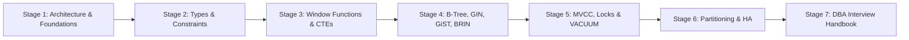
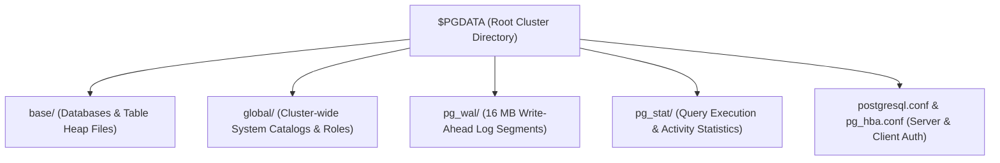
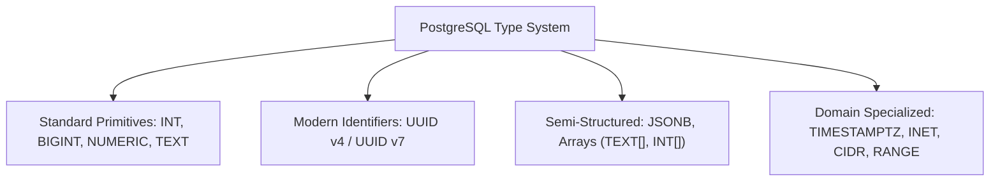
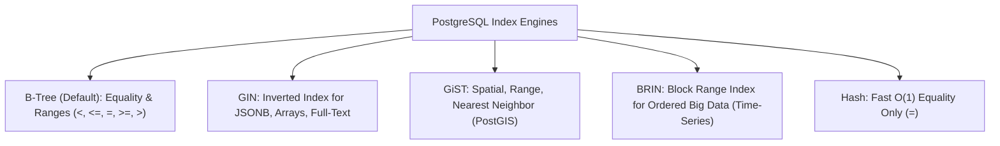
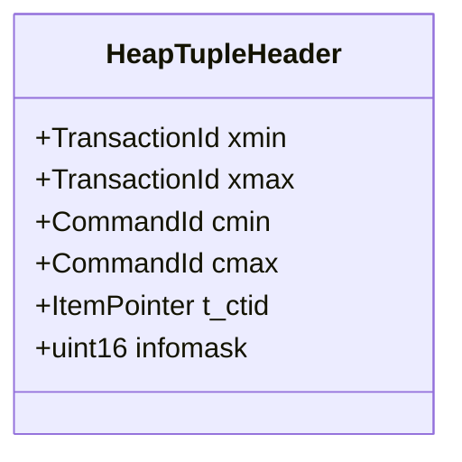
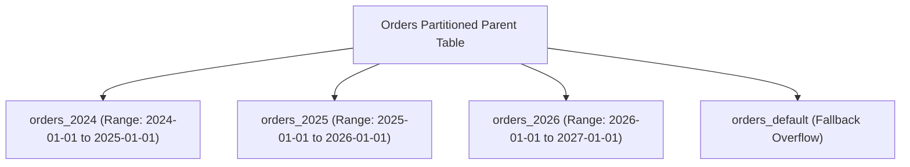
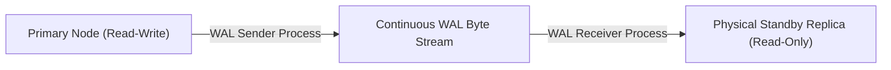

# Learn PostgreSQL 🐘

<div align="center">

[](https://opensource.org/licenses/MIT)
[](https://www.postgresql.org/)
[](https://nodejs.org/)
[](https://github.com/manthanank/learn-postgresql)

**An exhaustive, production-grade masterclass from absolute zero to staff-level Database Administrator (DBA) & Principal Backend Engineer.**  
Master PostgreSQL client-server architecture, Multi-Version Concurrency Control (MVCC), advanced JSONB querying, custom index engines (B-Tree, GIN, GiST, BRIN), declarative partitioning, streaming replication, connection pooling with PgBouncer, query planning with `EXPLAIN (ANALYZE, BUFFERS)`, and autovacuum tuning.

[Getting Started](#1-stage-1-absolute-beginner-foundations--relational-architecture) • [Schema & Types](#2-stage-2-core-data-types-schema-design--constraints) • [Advanced SQL](#3-stage-3-high-performance-querying-window-functions--ctes) • [Indexing Deep Dive](#4-stage-4-indexing-strategies--engine-internals) • [MVCC & Transactions](#5-stage-5-concurrency-mvcc--transaction-isolation) • [Replication & High Availability](#6-stage-6-enterprise-architecture-partitioning--replication) • [DBA Interview Handbook](#7-stage-7-staff-dba--systems-architect-interview-handbook)

<br/>

<a href="https://www.buymeacoffee.com/manthanank">
  
</a>

</div>

---

## 🗺️ 7-Stage Pedagogical Roadmap



| Stage | Focus Domain | Core Concepts & Engineering Outcomes |
| :--- | :--- | :--- |
| **Stage 1** | **Foundations & Architecture** | Postmaster daemon, shared memory architecture, Write-Ahead Logging (WAL), `psql` interactive CLI, databases vs schemas. |
| **Stage 2** | **Types, Schemas & Constraints** | UUID v4/v7, JSONB indexing, Array manipulation, Range types, `TIMESTAMPTZ`, CHECK constraints, generated columns. |
| **Stage 3** | **Advanced SQL, CTEs & Windows** | Recursive CTEs for graph traversal, Window functions (`ROW_NUMBER`, `DENSE_RANK`, `LAG`/`LEAD`), `FILTER` aggregation, lateral joins. |
| **Stage 4** | **Indexing Strategies & Internals** | B-Tree mechanics, GIN for inverted JSONB/Full-text, GiST for geospatial/ranges, BRIN for massive time-series, partial & covering indexes (`INCLUDE`). |
| **Stage 5** | **MVCC, Transactions & VACUUM** | `xmin`/`xmax` tuple headers, transaction isolation levels, row-level locking (`FOR UPDATE SKIP LOCKED`), autovacuum architecture & freeze maps. |
| **Stage 6** | **Partitioning & High Availability** | Declarative Range/List/Hash partitioning, streaming physical replication, logical replication, PgBouncer pooling, WAL archiving (pgBackRest). |
| **Stage 7** | **Staff DBA Interview Handbook** | `EXPLAIN (ANALYZE, BUFFERS)` execution plans, memory tuning (`shared_buffers`, `work_mem`), 25 staff interview questions, CLI cheat sheet. |

---

## 📋 Comprehensive Table of Contents

1. [Stage 1: Absolute Beginner Foundations & Relational Architecture](#1-stage-1-absolute-beginner-foundations--relational-architecture)
   - 1.1 [PostgreSQL Core Architecture: Postmaster, Shared Buffers & WAL](#11-postgresql-core-architecture-postmaster-shared-buffers--wal)
   - 1.2 [The Logical Structure: Cluster vs Database vs Schema](#12-the-logical-structure-cluster-vs-database-vs-schema)
   - 1.3 [psql Power CLI Masterclass](#13-psql-power-cli-masterclass)
   - 1.4 [Line-by-Line Breakdown: Core DDL Setup](#14-line-by-line-breakdown-core-ddl-setup)
2. [Stage 2: Core Data Types, Schema Design & Constraints](#2-stage-2-core-data-types-schema-design--constraints)
   - 2.1 [PostgreSQL Advanced Type System (JSONB, UUID, Array, Ranges)](#21-postgresql-advanced-type-system)
   - 2.2 [JSONB vs JSON: Binary Storage & Operators](#22-jsonb-vs-json-binary-storage--operators)
   - 2.3 [Integrity Constraints: CHECK, EXCLUDE, and Generated Columns](#23-integrity-constraints-check-exclude-and-generated-columns)
   - 2.4 [Line-by-Line Breakdown: Enterprise Multi-Tenant DDL](#24-line-by-line-breakdown-enterprise-multi-tenant-ddl)
3. [Stage 3: High-Performance Querying, Window Functions & CTEs](#3-stage-3-high-performance-querying-window-functions--ctes)
   - 3.1 [Common Table Expressions (CTEs) & Materialization Flags](#31-common-table-expressions-ctes--materialization-flags)
   - 3.2 [Recursive CTEs: Hierarchical Trees & Graph Traversal](#32-recursive-ctes-hierarchical-trees--graph-traversal)
   - 3.3 [Window Functions: Ranking, Offsets & Analytical Frames](#33-window-functions-ranking-offsets--analytical-frames)
   - 3.4 [LATERAL Joins: Correlated Subqueries on Steroids](#34-lateral-joins-correlated-subqueries-on-steroids)
   - 3.5 [Line-by-Line Breakdown: Advanced Financial Aggregation](#35-line-by-line-breakdown-advanced-financial-aggregation)
4. [Stage 4: Indexing Strategies & Engine Internals](#4-stage-4-indexing-strategies--engine-internals)
   - 4.1 [Index Type Taxonomy: B-Tree, Hash, GiST, GIN, BRIN](#41-index-type-taxonomy-b-tree-hash-gist-gin-brin)
   - 4.2 [GIN (Generalized Inverted Index) for JSONB & Full-Text Search](#42-gin-generalized-inverted-index-for-jsonb--full-text-search)
   - 4.3 [BRIN (Block Range Index): 100x Smaller Indexes for Massive Append-Only Data](#43-brin-block-range-index-for-massive-append-only-data)
   - 4.4 [Partial, Expression & Covering Indexes (INCLUDE)](#44-partial-expression--covering-indexes-include)
   - 4.5 [Index Bloat & Safe Maintenance: REINDEX CONCURRENTLY](#45-index-bloat--safe-maintenance-reindex-concurrently)
5. [Stage 5: Concurrency, MVCC & Transaction Isolation](#5-stage-5-concurrency-mvcc--transaction-isolation)
   - 5.1 [MVCC Internals: Heap Tuples, xmin, xmax, and cmin/cmax](#51-mvcc-internals-heap-tuples-xmin-xmax-and-cmincmax)
   - 5.2 [The 4 Transaction Isolation Levels & Anomaly Matrix](#52-the-4-transaction-isolation-levels--anomaly-matrix)
   - 5.3 [Row-Level Locking Patterns: FOR UPDATE SKIP LOCKED](#53-row-level-locking-patterns-for-update-skip-locked)
   - 5.4 [VACUUM, Freeze Maps & Autovacuum Tuning](#54-vacuum-freeze-maps--autovacuum-tuning)
6. [Stage 6: Enterprise Architecture, Partitioning & Replication](#6-stage-6-enterprise-architecture-partitioning--replication)
   - 6.1 [Declarative Partitioning: Range, List, and Hash](#61-declarative-partitioning-range-list-and-hash)
   - 6.2 [Physical Streaming Replication vs Logical Replication](#62-physical-streaming-replication-vs-logical-replication)
   - 6.3 [Connection Pooling with PgBouncer (Session vs Transaction Mode)](#63-connection-pooling-with-pgbouncer)
   - 6.4 [High Availability & Disaster Recovery: Patroni, WAL-G & pgBackRest](#64-high-availability--disaster-recovery)
7. [Stage 7: Staff DBA & Systems Architect Interview Handbook](#7-stage-7-staff-dba--systems-architect-interview-handbook)
   - 7.1 [Reading EXPLAIN (ANALYZE, BUFFERS): Plan Nodes, Costs & Filters](#71-reading-explain-analyze-buffers)
   - 7.2 [Kernel & Database Memory Tuning (shared_buffers, work_mem)](#72-kernel--database-memory-tuning)
   - 7.3 [25 Staff-Level PostgreSQL Interview Q&As](#73-25-staff-level-postgresql-interview-qas)
   - 7.4 [The Ultimate PostgreSQL DBA CLI & SQL Cheat Sheet](#74-the-ultimate-postgresql-dba-cli--sql-cheat-sheet)


---

## 1. Stage 1: Absolute Beginner Foundations & Relational Architecture

### 1.1 PostgreSQL Core Architecture: Postmaster, Shared Buffers & WAL
PostgreSQL is an enterprise-class, ACID-compliant, open-source object-relational database management system (ORDBMS).
Unlike multi-threaded database engines, PostgreSQL utilizes a robust **multi-process architecture**:

```mermaid
flowchart TD
    Client["Client App (Node.js / Python / Go)"] -->|TCP Connection| Postmaster["Postmaster Main Daemon (postgres)"]
    Postmaster -->|fork() Backend Process| Backend["Dedicated Backend Process (One per connection)"]

    subgraph SharedMemory["PostgreSQL Shared Memory Pool"]
        SharedBuffers["Shared Buffers (RAM Table Cache)"]
        WALBuffers["WAL Buffers (Log Cache)"]
        LockManager["Lock Table (Concurrency Locks)"]
    end

    Backend <--> SharedMemory

    subgraph BgProcesses["Auxiliary Background Processes"]
        BgWriter["Background Writer (bgwriter)"]
        Checkpointer["Checkpointer Process"]
        WALWriter["WAL Writer Process"]
        Autovacuum["Autovacuum Launcher & Workers"]
        StatsCollector["Statistics Collector"]
    end

    BgProcesses <--> SharedMemory

    subgraph Storage["Physical Disk Storage"]
        WALFiles["pg_wal / Transaction Log"]
        DataFiles["base/ (8 KB Heap & Index Pages)"]
    end

    Checkpointer -->|Sync Dirty Pages| DataFiles
    WALWriter -->|Sequential fsync| WALFiles
```

- **Postmaster Process**: The parent process that listens on port `5432`. For every incoming TCP client connection, Postmaster invokes `fork()` to spawn an independent, dedicated backend server process.
- **Shared Buffers**: A shared memory region allocated in RAM where PostgreSQL caches 8 KB table and index disk pages.
- **Write-Ahead Logging (WAL)**: Guaranteeing Durability (ACID). Every data mutation (INSERT, UPDATE, DELETE) is sequentially written to the WAL buffers and flushed to disk (`fsync`) *before* the dirty heap pages are written to table storage. In the event of an abrupt power outage, PostgreSQL replays the WAL to restore transactional consistency.

---

### 1.2 The Logical Structure: Cluster vs Database vs Schema
PostgreSQL enforces a strict hierarchy of data namespaces:

```text
PostgreSQL Instance (Cluster / Single Port 5432)
 ├── Database: production_db
 │    ├── Schema: public (Default)
 │    │    └── Tables, Views, Types, Functions
 │    ├── Schema: billing (Multi-tenant partition)
 │    └── Schema: analytics
 └── Database: staging_db
```

- **Cluster**: A single operating system directory (`PGDATA`) containing configuration files and storage managed by one PostgreSQL server process instance.
- **Database**: An isolated logical container within the cluster. Queries cannot easily join across separate databases without Foreign Data Wrappers (`postgres_fdw`).
- **Schema**: A namespace within a database. Schemas allow multiple teams or applications to coexist in the same database with identical table names without colliding (e.g. `billing.users` vs `public.users`).

---

### 1.3 psql Power CLI Masterclass
The interactive terminal client `psql` provides instant database inspection capabilities:

```bash
# Connect to PostgreSQL instance
psql -h localhost -p 5432 -U postgres -d production_db
```

| Meta-Command | Description | Technical Function |
| :--- | :--- | :--- |
| `\l` or `\l+` | **List Databases** | Displays all databases, owners, encoding (UTF-8), and disk size on disk. |
| `\c <dbname>` | **Connect Database** | Switches active connection context to another database. |
| `\dn` or `\dn+` | **List Schemas** | Displays all defined schemas and access privileges. |
| `\dt` or `\dt+` | **List Tables** | Lists tables in active schema with size and description. |
| `\d <tablename>` | **Describe Table** | Detailed schema breakdown: columns, data types, constraints, and defined indexes. |
| `\di` or `\di+` | **List Indexes** | Lists all indexes, associated tables, methods (btree, gin), and disk size. |
| `\x` | **Expanded Display** | Toggles horizontal/vertical record layout (essential for tables with 20+ columns). |
| `\timing` | **Execution Timer** | Toggles printing the query duration in milliseconds after each command. |

---

### 1.4 Line-by-Line Breakdown: Core DDL Setup
Initialize a production database with robust schema isolation:

```sql
-- 1. Create a dedicated application role with login privileges and password
CREATE ROLE app_user WITH LOGIN PASSWORD 'SuperSecretSecurePassword!2026';

-- 2. Create the target production database with UTF-8 encoding
CREATE DATABASE enterprise_core
  WITH OWNER = app_user
  ENCODING = 'UTF8'
  LC_COLLATE = 'en_US.UTF-8'
  LC_CTYPE = 'en_US.UTF-8';

-- 3. Connect to database
\c enterprise_core

-- 4. Create an isolated schema for the ecommerce service
CREATE SCHEMA IF NOT EXISTS ecommerce AUTHORIZATION app_user;

-- 5. Set default schema search path for the user
ALTER ROLE app_user SET search_path TO ecommerce, public;
```

| SQL Statement / Option | Purpose | Engineering Guarantee |
| :--- | :--- | :--- |
| `CREATE ROLE ... WITH LOGIN` | Security | Creates a non-superuser application account; disables risky administrative actions. |
| `ENCODING = 'UTF8'` | Globalization | Guarantees lossless multi-byte Unicode string storage across all languages. |
| `LC_COLLATE = 'en_US.UTF-8'` | Determinism | Enforces deterministic sorting rules for string indexes and `ORDER BY` clauses. |
| `CREATE SCHEMA ... AUTHORIZATION` | Multi-tenancy | Creates isolated namespace owned directly by the application service account. |
| `ALTER ROLE ... search_path` | Usability | Automatically resolves unqualified table names to the `ecommerce` schema first. |


---


---

### 1.5 PostgreSQL Physical File Layout on Disk ($PGDATA)
Inside the cluster data directory (`/var/lib/postgresql/data`), PostgreSQL maintains a deterministic folder structure:



| Directory / File | Purpose | Operational Characteristic |
| :--- | :--- | :--- |
| `base/<db_oid>/` | **Database Table Files** | Contains raw 8 KB data pages. Each table/index has an integer OID file (e.g. `16384`). Tables exceeding 1 GB are split into segments (`16384.1`, `16384.2`). |
| `global/` | **Cluster Metadata** | Tables shared across all databases: roles (`pg_authid`), databases (`pg_database`), and tablespaces. |
| `pg_wal/` | **WAL Segments** | Sequential 16 MB binary transaction log files (`000000010000000000000001`). Must never be manually deleted. |
| `pg_hba.conf` | **Host-Based Authentication**| Controls which IP addresses, subnets, and client users can connect and which cryptographic auth method is enforced (e.g. `scram-sha-256`). |
| `postgresql.auto.conf`| **Dynamic Settings** | Automatically rewritten when administrators execute `ALTER SYSTEM SET ...`. Overrides settings in `postgresql.conf`. |


## 2. Stage 2: Core Data Types, Schema Design & Constraints

### 2.1 PostgreSQL Advanced Type System
PostgreSQL offers the most comprehensive type system in the relational database world:



- **`NUMERIC` / `DECIMAL`**: Arbitrary-precision exact fixed-point number. Essential for monetary and financial balances; never use `FLOAT` or `REAL` for money due to binary rounding inaccuracy.
- **`TIMESTAMPTZ`**: Timestamp with timezone. Automatically converts input timestamps to UTC for storage, and translates to the client's local session timezone on retrieval.
- **`UUID`**: 128-bit Universally Unique Identifier (`uuid-ossp` or native `gen_random_uuid()` in PG 13+). Eliminates sequential ID enumeration security attacks.

---

### 2.2 JSONB vs JSON: Binary Storage & Operators
PostgreSQL provides two JSON types:

| Feature | `JSON` (Plain Text) | `JSONB` (Deconstructed Binary) |
| :--- | :--- | :--- |
| **Storage Representation** | Exact raw text copy with original whitespace. | Deconstructed binary format with duplicate keys stripped. |
| **Ingestion Speed** | Faster write ingestion (no parsing). | Slightly slower ingestion due to binary decomposition. |
| **Query Processing** | Slow (must re-parse text for every access). | Fast (direct pointer traversal without text parsing). |
| **Indexing Support** | Functional expression indexes only. | Supports GIN indexes, containment (`@>`), key existence (`?`). |
| **Recommendation** | Legacy logs where formatting must be preserved. | **99% of all production applications**. |

```sql
-- Querying JSONB with specialized operators:
SELECT
  id,
  metadata->>'tier' AS customer_tier,        -- ->> returns plain text
  metadata->'preferences'->>'theme' AS theme -- -> returns jsonb object
FROM accounts
WHERE metadata @> '{"status": "active", "tier": "enterprise"}'; -- GIN indexable containment
```

---

### 2.3 Integrity Constraints: CHECK, EXCLUDE, and Generated Columns
Guaranteed data integrity at the database layer prevents bad data from ever entering your system:

```sql
CREATE TABLE orders (
    order_id UUID PRIMARY KEY DEFAULT gen_random_uuid(),
    customer_id UUID NOT NULL,
    subtotal NUMERIC(12, 2) NOT NULL CHECK (subtotal >= 0.00),
    tax_rate NUMERIC(4, 4) NOT NULL DEFAULT 0.0825 CHECK (tax_rate >= 0.0000),
    -- Stored Generated Column calculated automatically by PostgreSQL:
    total_amount NUMERIC(12, 2) GENERATED ALWAYS AS (subtotal * (1 + tax_rate)) STORED,
    created_at TIMESTAMPTZ NOT NULL DEFAULT clock_timestamp()
);
```

---

### 2.4 Line-by-Line Breakdown: Enterprise Multi-Tenant DDL

```sql
CREATE TABLE ecommerce.products (
    id UUID PRIMARY KEY DEFAULT gen_random_uuid(),
    sku VARCHAR(64) NOT NULL UNIQUE,
    title TEXT NOT NULL,
    tags TEXT[] NOT NULL DEFAULT '{}',
    attributes JSONB NOT NULL DEFAULT '{}'::jsonb,
    price NUMERIC(10, 2) NOT NULL CHECK (price >= 0),
    stock_quantity INT NOT NULL DEFAULT 0 CHECK (stock_quantity >= 0),
    is_published BOOLEAN NOT NULL DEFAULT false,
    created_at TIMESTAMPTZ NOT NULL DEFAULT clock_timestamp(),
    updated_at TIMESTAMPTZ NOT NULL DEFAULT clock_timestamp()
);
```

| Column / Constraint | Technical Implementation | Purpose & Guarantee |
| :--- | :--- | :--- |
| `id UUID PRIMARY KEY` | `DEFAULT gen_random_uuid()` | Automatically generates non-conflicting 128-bit cryptographic random ID. |
| `sku VARCHAR(64) UNIQUE` | B-Tree Unique Index | Enforces uniqueness across product stock keeping units; rejects duplicates. |
| `tags TEXT[]` | Native PostgreSQL Array | Stores searchable list of product tags in one column; queryable via `tags && ARRAY['sale']`. |
| `attributes JSONB` | Binary JSON | Houses dynamic polymorphic specifications (size, color, weight) without schema migrations. |
| `CHECK (price >= 0)` | Check Constraint | Enforces business rule that prices cannot be negative at the storage layer. |
| `TIMESTAMPTZ DEFAULT clock_timestamp()`| Time Function | Records monotonic wall-clock time in UTC at the exact instant the row is inserted. |


---


---

### 2.5 Native Arrays, ENUMs & Range Types Deep Dive
PostgreSQL allows storing multi-dimensional arrays, type-safe enumerated lists, and continuous ranges:

```sql
-- 1. Create a custom ENUM type
CREATE TYPE order_status AS ENUM ('draft', 'pending_payment', 'processing', 'shipped', 'delivered', 'cancelled');

-- 2. Range Types for Date Ranges & Booking
CREATE TABLE hotel_reservations (
    reservation_id UUID PRIMARY KEY DEFAULT gen_random_uuid(),
    guest_name TEXT NOT NULL,
    room_number INT NOT NULL,
    stay_period DATERANGE NOT NULL,
    -- Prevent overlapping reservations for the same room
    CONSTRAINT no_overlapping_bookings EXCLUDE USING gist (
        room_number WITH =,
        stay_period WITH &&
    )
);

-- Query range containment: Check if room is booked on Christmas
SELECT * FROM hotel_reservations 
WHERE room_number = 101 AND stay_period @> '2026-12-25'::date;
```

| Range Operator | Operation Name | Technical Behavior |
| :--- | :--- | :--- |
| `&&` | **Overlaps** | Evaluates true if two ranges share any common points. |
| `@>` | **Contains** | Evaluates true if range contains the target point or sub-range. |
| `<@` | **Contained By** | Evaluates true if range is completely encompassed by outer range. |
| `-|-` | **Adjacent** | Evaluates true if two ranges touch boundaries without overlapping. |


## 3. Stage 3: High-Performance Querying, Window Functions & CTEs

### 3.1 Common Table Expressions (CTEs) & Materialization Flags
Common Table Expressions (`WITH` queries) break complex reporting logic into readable modular blocks.
Since PostgreSQL 12, CTEs are inlined automatically unless explicitly marked `MATERIALIZED`:

```sql
-- Inlineable CTE: Optimizer pushes WHERE conditions down into the CTE
WITH active_subscriptions AS (
    SELECT customer_id, plan_name, monthly_fee
    FROM subscriptions
    WHERE status = 'active'
)
SELECT * FROM active_subscriptions WHERE monthly_fee > 100;

-- Materialized CTE: Forces PostgreSQL to execute the CTE as an isolated temporary barrier
WITH high_volume_orders AS MATERIALIZED (
    SELECT customer_id, count(*) AS total_orders
    FROM orders
    GROUP BY customer_id
)
SELECT * FROM high_volume_orders WHERE total_orders > 500;
```

---

### 3.2 Recursive CTEs: Hierarchical Trees & Graph Traversal
Recursive CTEs allow querying arbitrary-depth organizational hierarchies, categories, or graph networks:

```sql
WITH RECURSIVE org_chart AS (
    -- 1. Anchor Member: Top of the hierarchy (CEO)
    SELECT employee_id, manager_id, full_name, 1 AS depth
    FROM employees
    WHERE manager_id IS NULL

    UNION ALL

    -- 2. Recursive Member: Direct reports of previous level
    SELECT e.employee_id, e.manager_id, e.full_name, o.depth + 1
    FROM employees e
    JOIN org_chart o ON e.manager_id = o.employee_id
)
SELECT depth, full_name, employee_id, manager_id
FROM org_chart
ORDER BY depth, full_name;
```

---

### 3.3 Window Functions: Ranking, Offsets & Analytical Frames
Unlike `GROUP BY`, which collapses rows into a single summary, **Window Functions** compute values over a partitioned window of rows while preserving each individual row identity!

```sql
SELECT
    order_id,
    customer_id,
    order_date,
    amount,
    -- 1. Sequential row order within customer history
    ROW_NUMBER() OVER (PARTITION BY customer_id ORDER BY order_date) AS order_sequence,
    -- 2. Running cumulative total spent by customer
    SUM(amount) OVER (
        PARTITION BY customer_id 
        ORDER BY order_date
        ROWS BETWEEN UNBOUNDED PRECEDING AND CURRENT ROW
    ) AS running_total,
    -- 3. Spend on previous order (for calculating growth)
    LAG(amount, 1, 0) OVER (PARTITION BY customer_id ORDER BY order_date) AS previous_order_amount,
    -- 4. Highest spender ranking across entire company
    DENSE_RANK() OVER (ORDER BY amount DESC) AS revenue_rank
FROM orders;
```

---

### 3.4 LATERAL Joins: Correlated Subqueries on Steroids
A `LATERAL` join behaves like a `foreach` loop in SQL, allowing an inner subquery to reference columns provided by preceding joined tables:

```sql
-- Retrieve each customer along with their 3 most recent high-value orders
SELECT 
    c.customer_id,
    c.email,
    latest_orders.order_id,
    latest_orders.amount,
    latest_orders.order_date
FROM customers c
CROSS JOIN LATERAL (
    SELECT o.order_id, o.amount, o.order_date
    FROM orders o
    WHERE o.customer_id = c.customer_id
    ORDER BY o.order_date DESC
    LIMIT 3
) latest_orders;
```

---

### 3.5 Line-by-Line Breakdown: Advanced Financial Aggregation

| SQL Construct | Operation | Analytical Purpose |
| :--- | :--- | :--- |
| `PARTITION BY customer_id` | Window Slicing | Divides dataset into independent analytical buckets per customer without collapsing rows. |
| `ROW_NUMBER()` | Monotonic Counter | Assigns unique 1, 2, 3... integer per partition. Guarantees deterministic deduplication. |
| `SUM() OVER (ROWS BETWEEN ...)` | Cumulative Framing | Dynamically sums all rows from start of partition up to current row (running balances). |
| `LAG(amount, 1, 0)` | Lead/Lag Offset | Inspects prior transaction amount to measure spend acceleration or churn risk. |
| `CROSS JOIN LATERAL` | Iterative Evaluation | Executes subquery once for every customer row; enables top-N-per-group optimization with indexes. |


---


---

### 3.6 Multi-Dimensional Aggregation: GROUPING SETS, ROLLUP & CUBE
When building executive business intelligence dashboards, calculating subtotals across multiple dimensions requires expensive `UNION ALL` queries in standard SQL. PostgreSQL solves this natively:

```sql
-- Compute revenue grouped by Region, Year, and overall Grand Total in a single pass!
SELECT
    coalesce(region, 'ALL REGIONS') AS region,
    coalesce(extract(year FROM order_date)::text, 'ALL YEARS') AS order_year,
    sum(amount) AS total_revenue
FROM orders
GROUP BY ROLLUP (region, extract(year FROM order_date))
ORDER BY region, order_year;
```

| Grouping Operator | Dimension Permutations Computed | Real-World Use Case |
| :--- | :--- | :--- |
| `GROUPING SETS ((a), (b))`| Computes summaries specifically for `(a)` and `(b)` independently. | Custom multi-dimensional reporting without running two queries. |
| `ROLLUP (a, b, c)` | Hierarchical subtotals: `(a,b,c)`, `(a,b)`, `(a)`, and `()` Grand Total. | Financial quarterly, annual, and cumulative reports. |
| `CUBE (a, b)` | All $2^N$ combinations: `(a,b)`, `(a)`, `(b)`, and `()`. | Full multi-dimensional OLAP exploratory data cubes. |


## 4. Stage 4: Indexing Strategies & Engine Internals

### 4.1 Index Type Taxonomy: B-Tree, Hash, GiST, GIN, BRIN
PostgreSQL supports 5 major index algorithms tailored for distinct data patterns:



| Index Engine | Best Suited For | Disk Space Footprint | Write Overhead |
| :--- | :--- | :--- | :--- |
| **B-Tree** | Primary keys, integers, timestamps, strings with `=`, `<`, `>` | Medium (10-30% of table) | Moderate |
| **GIN** | JSONB containment (`@>`), Arrays (`&&`), full-text search (`tsvector`) | Large (can exceed table size) | Heavy (pending list updates) |
| **GiST** | PostGIS coordinates (`geometry`), overlapping intervals (`&&`), KNN | Medium | Moderate |
| **BRIN** | Append-only logs, time-series, sequential IDs (millions of rows) | **Microscopic (0.1% of B-Tree)** | Near-Zero |
| **Hash** | Exact equality lookups only (`WHERE email = 'x'`) | Small-Medium | Light |

---

### 4.2 GIN (Generalized Inverted Index) for JSONB & Full-Text Search
A GIN index creates an inverted mapping where each JSON key-value pair or array element points to a bitmap list of matching table row IDs (`tid`):

```sql
-- 1. Indexing JSONB document with default jsonb_ops (supports @>, ?, ?&, ?|)
CREATE INDEX idx_products_attributes ON products USING gin (attributes);

-- 2. Indexing JSONB document with jsonb_path_ops (smaller index, strictly @> containment)
CREATE INDEX idx_products_path_ops ON products USING gin (attributes jsonb_path_ops);

-- Fast Index-Driven Query:
SELECT * FROM products WHERE attributes @> '{"color": "midnight_blue", "in_stock": true}';
```

---

### 4.3 BRIN (Block Range Index): 100x Smaller Indexes for Massive Append-Only Data
For tables with hundreds of millions of rows ordered chronologically (e.g. audit logs, sensor telemetry), a B-Tree index consumes gigabytes of RAM.
**BRIN** groups adjacent disk blocks (default: 128 pages = 1 MB) and records only the `[minimum, maximum]` values in that block range!

```sql
-- Create a BRIN index on a 500-million row telemetry table
CREATE INDEX idx_telemetry_timestamp ON telemetry USING brin (recorded_at) WITH (pages_per_range = 64);
```
- **Storage Comparison on 100GB Table**:
  - B-Tree Index: **~22 GB RAM**
  - BRIN Index: **~18 MB RAM (99.9% memory savings!)**

---

### 4.4 Partial, Expression & Covering Indexes (INCLUDE)

```sql
-- 1. Partial Index: Only index unpaid orders (skips 98% of paid records)
CREATE INDEX idx_unpaid_orders ON orders (customer_id) WHERE status = 'unpaid';

-- 2. Expression Index: Fast case-insensitive email searches
CREATE INDEX idx_users_lower_email ON users (lower(email));

-- 3. Covering Index (Index-Only Scan): Appends non-search payload to B-Tree leaf pages
CREATE INDEX idx_users_lookup ON users (email) INCLUDE (full_name, is_active);

-- The query below reads ONLY from RAM index leaf pages without fetching heap data pages!
SELECT email, full_name, is_active FROM users WHERE email = 'alex@enterprise.com';
```

---

### 4.5 Index Bloat & Safe Maintenance: REINDEX CONCURRENTLY
Frequent `UPDATE` and `DELETE` queries leave empty dead space in B-Tree index pages.
Rebuilding indexes without locking write queries in production:

```sql
-- Rebuild bloated index without blocking concurrent INSERT/UPDATE/DELETE queries
REINDEX INDEX CONCURRENTLY idx_orders_customer_id;
```


---

## 5. Stage 5: Concurrency, MVCC & Transaction Isolation

### 5.1 MVCC Internals: Heap Tuples, xmin, xmax, and cmin/cmax
PostgreSQL implements Multi-Version Concurrency Control (MVCC) so that **"Readers never block Writers, and Writers never block Readers."**
Every physical table row (tuple) contains hidden header metadata:



- **`xmin`**: The Transaction ID (`xid`) that inserted this tuple. The row is visible only to transactions newer than `xmin`.
- **`xmax`**: The Transaction ID that deleted or updated this tuple. If `xmax = 0`, the tuple has not been deleted. When a row is updated, PostgreSQL does not modify it in place; it inserts a new tuple with `xmin = current_xid` and marks the old tuple with `xmax = current_xid`.
- **`t_ctid`**: A pointer (`block_number`, `offset`) referencing the latest physical version of this row.

---

### 5.2 The 4 Transaction Isolation Levels & Anomaly Matrix
PostgreSQL supports 3 active ANSI SQL isolation levels (Read Uncommitted automatically maps to Read Committed):

| Isolation Level | Dirty Read | Non-Repeatable Read | Phantom Read | Serialization Anomaly |
| :--- | :---: | :---: | :---: | :---: |
| **Read Committed** (Default) | Prevented | **Possible** | **Possible** | **Possible** |
| **Repeatable Read** | Prevented | Prevented | Prevented | **Possible** |
| **Serializable** (SSI) | Prevented | Prevented | Prevented | Prevented |

- **Read Committed**: Each statement inside a transaction sees a new snapshot of committed data at the instant that *statement* begins executing.
- **Repeatable Read**: The entire transaction sees a consistent snapshot taken at the instant the *transaction* begins its first statement.
- **Serializable**: Uses Serializable Snapshot Isolation (SSI) to track read/write lock dependencies (`SIREAD` locks) and automatically aborts (`40001 serialization_failure`) any transaction that would create a cycle.

---

### 5.3 Row-Level Locking Patterns: FOR UPDATE SKIP LOCKED
High-throughput background job processing queues require safe concurrent work distribution:

```sql
-- Atomically claim 5 pending jobs without blocking worker threads:
BEGIN;

SELECT job_id, payload
FROM background_jobs
WHERE status = 'pending'
ORDER BY priority DESC, created_at ASC
LIMIT 5
FOR UPDATE SKIP LOCKED;

-- Mark claimed jobs as running and commit
UPDATE background_jobs
SET status = 'processing', worker_id = 'worker_node_01'
WHERE job_id IN (/* claimed ids */);

COMMIT;
```
- **`FOR UPDATE`**: Locks the selected rows against concurrent modifications.
- **`SKIP LOCKED`**: Skips any rows already locked by competing worker threads rather than waiting, achieving linear multi-core concurrency!

---

### 5.4 VACUUM, Freeze Maps & Autovacuum Tuning
Because updates create new tuple versions, old dead rows accumulate on disk (Dead Tuples).
**VACUUM** scans heap pages, marks dead tuple slots as reusable for future inserts, and updates the visibility map.

```sql
-- Inspect dead tuple accumulation and vacuum statistics
SELECT 
    schemaname,
    relname,
    n_live_tup,
    n_dead_tup,
    round(100.0 * n_dead_tup / nullif(n_live_tup + n_dead_tup, 0), 2) AS dead_percentage,
    last_vacuum,
    last_autovacuum
FROM pg_stat_user_tables
ORDER BY n_dead_tup DESC;
```

#### Production `postgresql.conf` Autovacuum Hardening
```ini
# Prevent transaction ID wraparound panic and eliminate bloat:
autovacuum = on
autovacuum_max_workers = 5
autovacuum_vacuum_cost_limit = 2000     # Higher limit allows workers to do more I/O
autovacuum_vacuum_scale_factor = 0.05   # Trigger vacuum when 5% of table is dead
autovacuum_analyze_scale_factor = 0.02  # Trigger analyze when 2% of table changes
```


---


---

### 5.5 Explicit Table Locking Modes & Deadlock Prevention
PostgreSQL features an 8-level table locking hierarchy. Knowing which statement triggers which lock prevents unexpected production outages:

| Lock Mode | Acquired By SQL Commands | Conflicts With (Blocks) |
| :--- | :--- | :--- |
| `ACCESS SHARE` | `SELECT` | `ACCESS EXCLUSIVE` (e.g. `DROP TABLE`, `ALTER TABLE`) |
| `ROW SHARE` | `SELECT FOR UPDATE`, `SELECT FOR SHARE` | `EXCLUSIVE`, `ACCESS EXCLUSIVE` |
| `ROW EXCLUSIVE` | `INSERT`, `UPDATE`, `DELETE` | `SHARE`, `SHARE ROW EXCLUSIVE`, `EXCLUSIVE`, `ACCESS EXCLUSIVE` |
| `SHARE UPDATE EXCLUSIVE` | `VACUUM` (non-full), `ANALYZE`, `CREATE INDEX CONCURRENTLY` | `SHARE UPDATE EXCLUSIVE` and higher |
| `SHARE` | `CREATE INDEX` (standard non-concurrent) | `ROW EXCLUSIVE`, `SHARE ROW EXCLUSIVE`, `EXCLUSIVE`, `ACCESS EXCLUSIVE` |
| `ACCESS EXCLUSIVE` | `DROP TABLE`, `TRUNCATE`, `ALTER TABLE`, `VACUUM FULL` | **ALL OTHER LOCKS (Blocks even basic SELECT!)** |


## 6. Stage 6: Enterprise Architecture, Partitioning & Replication

### 6.1 Declarative Partitioning: Range, List, and Hash
Declarative partitioning divides a massive monolithic table into smaller physical partitions while maintaining a single unified query interface:



```sql
-- 1. Define Partitioned Parent Table
CREATE TABLE enterprise_orders (
    order_id UUID NOT NULL,
    order_date DATE NOT NULL,
    customer_id UUID NOT NULL,
    amount NUMERIC(12, 2) NOT NULL,
    status TEXT NOT NULL
) PARTITION BY RANGE (order_date);

-- 2. Create Explicit Annual Child Partitions
CREATE TABLE enterprise_orders_2025 PARTITION OF enterprise_orders
    FOR VALUES FROM ('2025-01-01') TO ('2026-01-01');

CREATE TABLE enterprise_orders_2026 PARTITION OF enterprise_orders
    FOR VALUES FROM ('2026-01-01') TO ('2027-01-01');

-- 3. Partition Pruning in Action
-- The query planner evaluates WHERE conditions and scans ONLY enterprise_orders_2026,
-- completely skipping all older partitions from disk I/O!
EXPLAIN SELECT * FROM enterprise_orders WHERE order_date = '2026-05-15';
```

---

### 6.2 Physical Streaming Replication vs Logical Replication



| Feature | Physical Streaming Replication | Logical Replication (Pub/Sub) |
| :--- | :--- | :--- |
| **Replication Level** | Exact physical disk block replication (byte-by-byte). | Logical SQL row changes (`INSERT`, `UPDATE`, `DELETE`). |
| **Schema Flexibility** | Standby must be 100% identical byte clone. | Target can have different indexes, schemas, or versions. |
| **Cross-Version Support**| No (same major PG version required). | **Yes** (replicate PG 14 to PG 17 for zero-downtime upgrades). |
| **Selective Tables** | All-or-nothing (entire cluster). | Selective (publish specific tables to specific subscribers). |
| **Write Access on Target**| Standby is strictly Read-Only. | Target replica is writable and can accept local tables. |

---

### 6.3 Connection Pooling with PgBouncer
Because each PostgreSQL connection spawns an operating system process consuming ~10 MB RAM, exceeding 500–1,000 connections will exhaust memory and saturate the CPU scheduler.
**PgBouncer** sits in front of PostgreSQL, multiplexing 10,000 application client connections into 50 pooled database connections:

```ini
# /etc/pgbouncer/pgbouncer.ini
[databases]
production_db = host=127.0.0.1 port=5432 dbname=production_db

[pgbouncer]
listen_port = 6432
listen_addr = *
auth_type = scram-sha-256
auth_file = /etc/pgbouncer/userlist.txt

# Pooling Modes:
# session: Connection held until client disconnects (safest, lowest scaling)
# transaction: Connection returned to pool immediately after COMMIT (Recommended for APIs)
# statement: Connection returned after each query (disallows multi-statement transactions)
pool_mode = transaction

max_client_conn = 10000
default_pool_size = 50
reserve_pool_size = 10
```

---

### 6.4 High Availability & Disaster Recovery
- **Patroni**: A production-grade High Availability template utilizing distributed consensus (etcd, Consul) to manage automatic failover, leader elections, and zero-data-loss standby promotion.
- **pgBackRest / WAL-G**: Enterprise backup tools supporting multi-threaded parallel compression, full/differential/incremental backups, and **Point-In-Time Recovery (PITR)** to restore the database to any specific second in time.


---

## 7. Stage 7: Staff DBA & Systems Architect Interview Handbook

### 7.1 Reading EXPLAIN (ANALYZE, BUFFERS)
The single most critical skill in database tuning is dissecting execution plans:

```sql
EXPLAIN (ANALYZE, BUFFERS, VERBOSE, SETTINGS)
SELECT c.customer_id, count(o.order_id)
FROM customers c
JOIN orders o ON c.customer_id = o.customer_id
WHERE c.country = 'US'
GROUP BY c.customer_id;
```

#### Plan Node Diagnostic Checklist
1. **Execution Time vs Planning Time**: Is query planning taking longer than execution? (Often caused by thousands of partitions or excessive joins).
2. **Sequential Scan (`Seq Scan`) vs Index Scan**: Did the optimizer scan the entire table because of missing indexes, low selectivity, or un-analyzed table statistics?
3. **`Buffers: shared hit=420 read=12`**:
   - `hit`: 8 KB pages found already cached in RAM (`shared_buffers`).
   - `read`: 8 KB pages that had to be read from physical SSD storage (slow).
4. **Join Mechanisms**:
   - `Hash Join`: Builds hash table in memory (`work_mem`). Excellent for large unsorted datasets.
   - `Nested Loop`: Loops over outer table and probes inner table via index. Optimal for small row counts.
   - `Merge Join`: Merges two pre-sorted inputs. Ideal when indexes exist on join columns for both tables.

---

### 7.2 Kernel & Database Memory Tuning
Optimal configuration for a dedicated 64 GB RAM production database server:

```ini
# /etc/postgresql/16/main/postgresql.conf

# 1. Shared Buffers: RAM dedicated to caching table pages (25% of Total System RAM)
shared_buffers = 16GB

# 2. Effective Cache Size: Estimated total RAM available for caching (75% of System RAM)
effective_cache_size = 48GB

# 3. Work Mem: Dedicated RAM per sort / hash operation per query
work_mem = 64MB

# 4. Maintenance Work Mem: RAM for VACUUM, CREATE INDEX, and ALTER TABLE
maintenance_work_mem = 2GB

# 5. Checkpoint Tuning: Maximize throughput by smoothing disk writes
checkpoint_timeout = 15min
max_wal_size = 16GB
min_wal_size = 2GB
checkpoint_completion_target = 0.9

# 6. Query Planner Cost Constants for NVMe SSD Storage
random_page_cost = 1.1     # Default 4.0 is for slow spinning HDDs!
seq_page_cost = 1.0
```

---

### 7.3 25 Staff-Level PostgreSQL Interview Q&As

#### Q1: How does PostgreSQL MVCC differ from MySQL InnoDB undo-log MVCC?
**Answer:** In MySQL InnoDB, when a row is updated, the row is modified in-place on the clustered index page, and the prior historical version is written to a rollback segment (**undo log**). In PostgreSQL, updates are implemented by writing an entirely new version of the tuple (**heap tuple**) into the table page, marking the old tuple's `xmax` with the current transaction ID. PostgreSQL requires `VACUUM` to reclaim old dead tuples, whereas InnoDB purges undo logs. The advantage of PostgreSQL's approach is that rollback is instantaneous (no undo log replay required) and long-running transactions do not cause undo tablespace bloat.

#### Q2: What causes Transaction ID (XID) Wraparound, and how does PostgreSQL prevent it?
**Answer:** PostgreSQL uses 32-bit unsigned integers for Transaction IDs, yielding approximately 4.2 billion unique IDs. Because transactions are compared cyclically modulo $2^{31}$, if a database executes more than 2 billion transactions without maintenance, old transaction IDs would suddenly appear to be in the future, rendering all historical table rows invisible (catastrophic data loss). To prevent this, PostgreSQL uses **tuple freezing**. During freezing, the `xmin` is replaced with a special frozen XID (`FrozenTransactionId = 2`), marking the tuple as permanently visible to all past and future transactions. The `autovacuum` daemon aggressively triggers anti-wraparound vacuums when `autovacuum_freeze_max_age` (default 200 million) is reached.

#### Q3: What is the difference between an Index Scan, a Bitmap Index Scan, and an Index-Only Scan?
**Answer:** 
- **Index Scan**: Traverses the B-Tree index to locate a tuple pointer (`ctid`), then immediately visits the heap page on disk to retrieve the full row. Ideal for fetching a small number of rows ($<1-2\%$).
- **Bitmap Index Scan**: Scans the index, builds a bitmapped memory structure of pages containing matching rows, sorts the page references sequentially to convert random disk I/O into sequential disk I/O, and then fetches the data pages from the heap.
- **Index-Only Scan**: If all columns requested in the `SELECT` clause are present directly in the index (via multi-column or `INCLUDE`), and the Visibility Map confirms that the table page contains no un-vacuumed dead tuples, PostgreSQL returns data directly from the index without reading table heap storage at all.

#### Q4: Why does `SELECT COUNT(*)` on a large table take a long time in PostgreSQL compared to MySQL MyISAM?
**Answer:** MySQL MyISAM stored a single hardcoded row counter in table metadata, but lacked transaction isolation. In PostgreSQL, because of MVCC, every transaction sees a different snapshot of the database depending on uncommitted updates, active transactions, and deletions. A row is only visible if its `xmin` is committed and its `xmax` is either uncommitted or greater than the current snapshot. Therefore, PostgreSQL must evaluate the visibility of every single tuple, requiring an extensive sequential scan or index-only scan across the entire table.

#### Q5: What is the Visibility Map, and how does it optimize database performance?
**Answer:** The Visibility Map (VM) is a two-bit bitmap for each 8 KB heap page in a table. Bit 0 indicates whether all tuples on the page are visible to all active and future transactions (i.e. no dead tuples exist on the page). Bit 1 indicates whether all tuples on the page are frozen. The VM optimizes operations in two huge ways:
1. `VACUUM` skips scanning pages marked fully visible/frozen, drastically reducing maintenance I/O.
2. **Index-Only Scans** check the VM bit; if the page is all-visible, the engine returns data directly from the index without visiting the heap page to verify MVCC visibility.

#### Q6: Explain the difference between `TOAST` and standard in-line heap storage.
**Answer:** The standard table page size in PostgreSQL is fixed at 8 KB and cannot span across multiple disk blocks. If a row contains large text, JSONB, or bytea fields exceeding 2 KB (`TOAST_TUPLE_THRESHOLD`), PostgreSQL activates **TOAST** (The Oversized-Attribute Storage Technique). The large column value is compressed (via pglz or lz4) and, if still exceeding threshold, is broken into chunks and stored in an auxiliary out-of-line TOAST table. The main table tuple retains only an 18-byte pointer (`toast pointer`) referencing the chunks.

#### Q7: How do you eliminate Table Bloat without causing a long-running exclusive write lock?
**Answer:** Running `VACUUM FULL` rewrites the entire table into a new disk file, reclaiming all dead space, but acquires an exclusive table lock (`ACCESS EXCLUSIVE`) that blocks all reads and writes until completion. In production, engineers use:
1. **`pg_repack`**: An extension that creates a log table, copies data into a new table in the background, replays modifications, and swaps the tables via a brief metadata lock.
2. Partition pruning: Dropping obsolete partitions instantly (`DROP TABLE partition_2023`) without vacuum overhead.

#### Q8: What is HOT (Heap-Only Tuples) optimization, and what conditions are required for it to activate?
**Answer:** HOT optimization eliminates index maintenance when a row is updated. Normally, updating a row requires adding a new index pointer for every index on that table. With HOT, if the updated row fits inside the **same 8 KB heap page** as the original, and **none of the indexed columns were modified**, PostgreSQL links the old tuple directly to the new tuple via a pointer chain (`ctid`). Index entries continue pointing to the old tuple, and the engine traverses the HOT chain inside the page, saving massive index write I/O.

#### Q9: What is the difference between `synchronous_commit = on` vs `off` vs `remote_apply`?
**Answer:** 
- `on` (Default): The backend waits for the local WAL to be written to disk before returning success to the client. Guarantees durability on local machine.
- `off`: The transaction commits immediately in memory; WAL is flushed asynchronously up to `wal_writer_delay` (default 200ms). Provides 5x–10x write throughput boost at the risk of losing up to 200ms of data during an abrupt power cut (no database corruption occurs, only lost commits).
- `remote_apply`: In streaming replication, waits until the replica node has not only received and written the WAL, but actively replayed it so that standby reads are immediately consistent (zero read lag).

#### Q10: How do you identify and resolve Deadlocks in high-concurrency applications?
**Answer:** A deadlock occurs when Transaction A holds Lock 1 and requests Lock 2, while Transaction B holds Lock 2 and requests Lock 1. PostgreSQL detects deadlocks automatically after `deadlock_timeout` (default 1 second) by traversing the lock dependency graph and aborts one of the transactions with error code `40P01`. To prevent deadlocks:
1. Always acquire locks and update tables in a strict, deterministic alphabetical or numerical order across all application endpoints.
2. Group updates into short, atomic transactions.
3. Use row-level locking timeouts (`SET lock_timeout = '2s';`).

#### Q11: What are Foreign Data Wrappers (FDWs) and how are they used in distributed data pipelines?
**Answer:** PostgreSQL Foreign Data Wrappers (SQL/MED standard via `postgres_fdw`, `mysql_fdw`, `mongo_fdw`) allow a PostgreSQL cluster to map external remote databases, CSV files, or REST APIs as virtual foreign tables inside your local schema. Queries can join local tables with remote foreign tables seamlessly, with the PostgreSQL optimizer pushing filters and aggregations down to the remote server.

#### Q12: Why should `random_page_cost` be adjusted from 4.0 to 1.1 on modern NVMe drives?
**Answer:** By default, PostgreSQL assumes data is stored on mechanical spinning hard disk drives (HDDs), where random disk seeks are 4x more expensive than sequential reads (`random_page_cost = 4.0`, `seq_page_cost = 1.0`). On modern NVMe SSDs, random access has virtually identical latency to sequential access. Leaving the cost at 4.0 misleads the query planner into believing index scans are prohibitively expensive, causing it to incorrectly choose slow sequential scans. Lowering it to `1.1` ensures the optimizer prefers index scans.

#### Q13: What is the difference between `SERIAL` and `IDENTITY` columns?
**Answer:** `SERIAL` is a non-standard legacy PostgreSQL pseudo-type that creates an independent sequence object (`tablename_col_seq`) and sets `DEFAULT nextval('...')`. If a user inserts an explicit value or copies the table, the sequence easily gets out of sync, causing duplicate key violations. `GENERATED ALWAYS AS IDENTITY` conforms strictly to SQL:2003 standard, tightly couples the sequence to the table, and prevents accidental direct manual overrides unless `OVERRIDING SYSTEM VALUE` is specified.

#### Q14: How does PostgreSQL handle full-text search with `tsvector` and `tsquery`?
**Answer:** Full-text search converts raw text into a `tsvector` (a sorted list of distinct normalized lexemes/stems with word position pointers, stripping stop words like "the", "and"). Searches are performed using `tsquery` with boolean logic (`&`, `|`, `!`, `<->` phrase search). By indexing the `tsvector` column with a **GIN index**, searches across millions of articles execute in single-digit milliseconds.

#### Q15: Explain how `pg_stat_statements` helps diagnose slow production queries.
**Answer:** `pg_stat_statements` is a core PostgreSQL extension that tracks execution statistics across all SQL queries executed on the cluster. It aggregates metrics by query fingerprint: total execution time, mean/max time, total calls, buffer hits vs disk reads, and rows returned. Querying `pg_stat_statements` ordered by `total_exec_time DESC` instantly identifies the queries consuming the greatest aggregate database resources.

#### Q16: How does PostgreSQL implement declarative partition pruning at execution time?
**Answer:** Partition pruning is evaluated in two phases:
1. **Plan-Time Pruning**: The query planner inspects constant conditions in the `WHERE` clause (e.g. `WHERE order_date = '2026-01-01'`) and excludes non-matching partitions from the query plan entirely.
2. **Run-Time Pruning**: When queries contain parameterized values or subqueries (e.g. `WHERE order_date = CURRENT_DATE`), the engine cannot prune during planning. Instead, during execution initialization, the executor evaluates the parameter once and prunes unneeded partitions before scanning.

#### Q17: What is the difference between `statement_timeout`, `lock_timeout`, and `idle_in_transaction_session_timeout`?
**Answer:**
- `statement_timeout`: Aborts any query that takes longer than the specified milliseconds.
- `lock_timeout`: Aborts a query if it cannot acquire its required lock within the specified duration, preventing connection pool pileups.
- `idle_in_transaction_session_timeout`: Terminates sessions that opened a transaction (`BEGIN`) but remained idle without committing or rolling back, preventing idle connections from holding locks and blocking autovacuum.

#### Q18: What are Exclusion Constraints and when would you use them?
**Answer:** Exclusion constraints (`EXCLUDE USING gist (...)`) guarantee that if any two rows are compared on specified columns using designated operators, at least one comparison returns false. The classic use case is preventing overlapping booking schedules (e.g. reserving a hotel room or meeting room for a date range `tsrange`):
`EXCLUDE USING gist (room_id WITH =, booking_interval WITH &&)`.

#### Q19: What is the role of the Checkpointer process and `checkpoint_completion_target`?
**Answer:** Checkpoints flush all dirty shared memory buffers to physical disk files and write a checkpoint record to the WAL, establishing a recovery baseline. If a crash occurs, PostgreSQL only needs to replay WAL records created *after* the latest checkpoint. `checkpoint_completion_target = 0.9` instructs the checkpointer to spread dirty page disk writes smoothly across 90% of the `checkpoint_timeout` window, avoiding sudden I/O spikes that stall normal queries.

#### Q20: How does PostgreSQL handle connection termination and abandoned sessions?
**Answer:** If a client abruptly crashes or drops its network connection, the operating system TCP keepalive probes eventually detect the broken socket. In PostgreSQL, setting `tcp_keepalives_idle`, `tcp_keepalives_interval`, and `tcp_keepalives_count` ensures that dead client connections are detected within 60–120 seconds and their locks released.

#### Q21: What are Stored Procedures vs Functions in PostgreSQL?
**Answer:** A `FUNCTION` always executes inside the calling transaction context and cannot issue explicit transaction management commands like `COMMIT` or `ROLLBACK`. A `PROCEDURE` (introduced in PG 11, invoked via `CALL`) can explicitly commit and begin new transactions midway through its execution loop, which is essential for batch ETL migrations processing millions of records.

#### Q22: What is the difference between GiST and SP-GiST indexes?
**Answer:** GiST (Generalized Search Tree) is a balanced, tree-structured access method used for arbitrary geometric, range, and multi-dimensional data. SP-GiST (Space-Partitioned GiST) is designed for non-balanced data spaces (like quadtrees, k-d trees, and radix trie prefix trees), offering faster search times when data distribution is non-uniform (e.g. phone numbers or IP addresses).

#### Q23: How do you perform zero-downtime schema migrations when adding a column with a default value?
**Answer:** In older versions of PostgreSQL, adding a column with a default value (`ALTER TABLE orders ADD COLUMN status TEXT DEFAULT 'active'`) rewritten the entire table to write the default to every tuple on disk, taking hours and locking the table. Since PostgreSQL 11, adding a column with a constant default simply updates the catalog metadata without touching the heap tuples; missing values are synthesized on read in constant time $O(1)$.

#### Q24: What is Logical Decoding and how does it power Change Data Capture (CDC)?
**Answer:** Logical Decoding reads raw binary WAL stream segments from disk, decodes them using an output plugin (e.g. `pgoutput`), and transforms them into a readable stream of logical row-level events (`INSERT`, `UPDATE`, `DELETE`). Tools like **Debezium** stream these events directly into Apache Kafka for real-time microservice synchronization and analytics.

#### Q25: How do you recover from database corruption if a disk block fails checksum verification?
**Answer:** If `data_checksums = on` was enabled, PostgreSQL flags corrupt 8 KB blocks with a checksum error upon read. Recovery options include:
1. Failover immediately to a healthy physical streaming replica.
2. Perform Point-In-Time Recovery (PITR) using the last base backup and WAL archives.
3. If no backup exists, use `zero_damaged_pages = on` to zero out the corrupt page and salvage remaining accessible table records, accepting the loss of tuples located on the damaged block.

---

### 7.4 The Ultimate PostgreSQL DBA CLI & SQL Cheat Sheet

#### Real-Time Activity & Lock Diagnostics
```sql
-- 1. View active running queries and their execution duration
SELECT pid, usename, client_addr, state, now() - query_start AS duration, query
FROM pg_stat_activity
WHERE state != 'idle'
ORDER BY duration DESC;

-- 2. Terminate a rogue long-running query gracefully (SIGTERM)
SELECT pg_cancel_backend(14208);

-- 3. Force-kill an unresponsive query backend (SIGKILL)
SELECT pg_terminate_backend(14208);

-- 4. Find blocking and blocked queries
SELECT
    blocked_locks.pid AS blocked_pid,
    blocking_locks.pid AS blocking_pid,
    blocked_activity.query AS blocked_statement,
    blocking_activity.query AS blocking_statement
FROM pg_catalog.pg_locks blocked_locks
JOIN pg_catalog.pg_stat_activity blocked_activity ON blocked_activity.pid = blocked_locks.pid
JOIN pg_catalog.pg_locks blocking_locks 
    ON blocking_locks.locktype = blocked_locks.locktype
    AND blocking_locks.database IS NOT DISTINCT FROM blocked_locks.database
    AND blocking_locks.relation IS NOT DISTINCT FROM blocked_locks.relation
    AND blocking_locks.page IS NOT DISTINCT FROM blocked_locks.page
    AND blocking_locks.tuple IS NOT DISTINCT FROM blocked_locks.tuple
    AND blocking_locks.virtualxid IS NOT DISTINCT FROM blocked_locks.virtualxid
    AND blocking_locks.transactionid IS NOT DISTINCT FROM blocked_locks.transactionid
    AND blocking_locks.classid IS NOT DISTINCT FROM blocked_locks.classid
    AND blocking_locks.objid IS NOT DISTINCT FROM blocked_locks.objid
    AND blocking_locks.objsubid IS NOT DISTINCT FROM blocked_locks.objsubid
    AND blocking_locks.pid != blocked_locks.pid
JOIN pg_catalog.pg_stat_activity blocking_activity ON blocking_activity.pid = blocking_locks.pid
WHERE NOT blocked_locks.granted;
```

#### Cache Hit Ratio & Storage Metrics
```sql
-- 1. Calculate Buffer Cache Hit Ratio (Should be > 99%)
SELECT 
    sum(heap_blks_hit) / nullif(sum(heap_blks_hit) + sum(heap_blks_read), 0) * 100 AS cache_hit_ratio
FROM pg_statio_user_tables;

-- 2. Inspect Top 10 Largest Tables and Indexes on Disk
SELECT 
    relname AS table_name,
    pg_size_pretty(pg_total_relation_size(relid)) AS total_size,
    pg_size_pretty(pg_relation_size(relid)) AS table_size,
    pg_size_pretty(pg_total_relation_size(relid) - pg_relation_size(relid)) AS index_size
FROM pg_catalog.pg_statio_user_tables
ORDER BY pg_total_relation_size(relid) DESC
LIMIT 10;
```

---

## 🤝 Community & Contributing
Contributions are welcome! Please review our [CONTRIBUTING.md](CONTRIBUTING.md) and [CODE_OF_CONDUCT.md](CODE_OF_CONDUCT.md) guidelines before opening issues or submitting pull requests.

## 📄 License
This project is open-source software licensed under the [MIT License](LICENSE).


### Complete PostgreSQL Advanced Production Code Examples

#### 1. Window Functions: Analytical Partitioning & Running Totals
Calculate intra-partition rankings, running aggregates, and month-over-month growth without expensive self-joins:

```sql
SELECT 
  employee_id,
  department_id,
  salary,
  -- 1. Sequential row counter within department
  ROW_NUMBER() OVER (PARTITION BY department_id ORDER BY salary DESC) AS row_num,
  -- 2. Rank with ties leaving gaps (1, 2, 2, 4)
  RANK() OVER (PARTITION BY department_id ORDER BY salary DESC) AS rank_with_gaps,
  -- 3. Rank without gaps (1, 2, 2, 3)
  DENSE_RANK() OVER (PARTITION BY department_id ORDER BY salary DESC) AS dense_rank_continuous,
  -- 4. Running department payroll total
  SUM(salary) OVER (
    PARTITION BY department_id 
    ORDER BY salary DESC 
    ROWS BETWEEN UNBOUNDED PRECEDING AND CURRENT ROW
  ) AS cumulative_dept_salary,
  -- 5. Value from previous row (for period-over-period difference)
  LAG(salary, 1, 0) OVER (PARTITION BY department_id ORDER BY hire_date) AS prev_employee_salary
FROM employees;
```

---

#### 2. Recursive CTE: Hierarchical Organization Tree Traversal with Cycle Detection
Traverses nested parent-child trees (managers, nested comments, category graphs) to arbitrary depth:

```sql
WITH RECURSIVE org_hierarchy AS (
  -- Anchor Member: Root executives who have no manager (manager_id IS NULL)
  SELECT 
    id, 
    name, 
    manager_id, 
    1 AS hierarchy_level,
    ARRAY[id] AS path
  FROM employees
  WHERE manager_id IS NULL

  UNION ALL

  -- Recursive Member: Subordinates joining to parent in previous iteration
  SELECT 
    e.id, 
    e.name, 
    e.manager_id, 
    oh.hierarchy_level + 1,
    oh.path || e.id
  FROM employees e
  JOIN org_hierarchy oh ON e.manager_id = oh.id
  -- Prevent infinite recursion cycles
  WHERE NOT (e.id = ANY(oh.path))
)
SELECT 
  hierarchy_level,
  REPEAT('  ', hierarchy_level - 1) || name AS formatted_hierarchy,
  path
FROM org_hierarchy
ORDER BY path;
```

---

#### 3. JSONB Power Operations & GIN Index Optimization
Query, update, and search nested semi-structured documents at native relational speeds:

```sql
-- 1. Create table with semi-structured JSONB payload
CREATE TABLE customer_events (
  id BIGSERIAL PRIMARY KEY,
  customer_id UUID NOT NULL,
  metadata JSONB NOT NULL,
  created_at TIMESTAMPTZ DEFAULT NOW()
);

-- 2. Create specialized GIN index with jsonb_path_ops for lightning fast @> containment searches
CREATE INDEX idx_events_metadata_gin ON customer_events USING gin (metadata jsonb_path_ops);

-- 3. Query records where client OS is Linux and purchase was completed (uses GIN index)
SELECT id, customer_id, metadata->'device'->>'browser' AS browser
FROM customer_events
WHERE metadata @> '{"device": {"os": "Linux"}, "event": "checkout_completed"}';

-- 4. Atomic In-Place JSONB Modification (update nested version flag and delete tracking token)
UPDATE customer_events
SET metadata = jsonb_set(metadata, '{app_version}', '"2.4.0"') - 'tracking_token'
WHERE id = 42;

-- 5. JSON Path Query (Extract all cart items priced over $50)
SELECT 
  id,
  jsonb_path_query(metadata, '$.cart.items[*] ? (@.price > 50)') AS expensive_item
FROM customer_events;
```

---

#### 4. Zero-Downtime Schema Migrations & Covering Indexes
Perform non-blocking index additions and index-only scans on multi-terabyte tables:

```sql
-- 1. Create index without acquiring ACCESS EXCLUSIVE write locks
-- Allows continuous reads and writes during index compilation
CREATE INDEX CONCURRENTLY idx_users_email_verified 
ON users (email) 
WHERE is_verified = TRUE;

-- 2. Covering Index using INCLUDE: Enables Index-Only Scan (skips Heap lookup)
CREATE INDEX idx_orders_customer_covering 
ON orders (customer_id, order_date DESC) 
INCLUDE (total_amount, status);

-- The following query reads 100% of data directly from index B-Tree without touching table heap:
EXPLAIN ANALYZE
SELECT customer_id, order_date, total_amount, status
FROM orders
WHERE customer_id = 'a0eebc99-9c0b-4ef8-bb6d-6bb9bd380a11'
ORDER BY order_date DESC;
```
